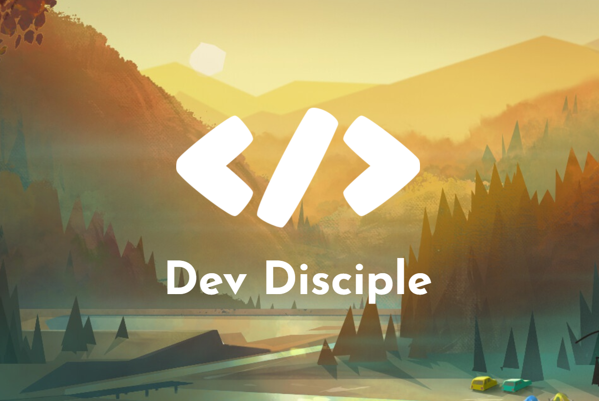

# Project One - Basic HTML & CSS

> **Dev Disciple Info Site** *(Made the week of 1/24/2022)*
>
> Basic information site with 4 webpages built with only HTML and CSS. There is zero functionality and it's not even finished. There is a small Javascript game in the "Play" section, found on the sidebar. It is a test project found on the MDN Web Docs [A first splash into JavaScript](https://developer.mozilla.org/en-US/docs/Learn/JavaScript/First_steps/A_first_splash) that I didn't bother getting rid of.
>
> 